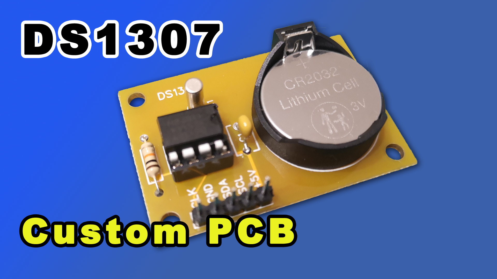

# DS1307

## Description

The DS1307 Serial Real-Time Clock is a low-power, full binary-coded decimal (BCD) clock/calendar
plus 56 bytes of NV SRAM. Address and data are transferred serially via a 2-wire, bi-directional bus.
The clock/calendar provides seconds, minutes, hours, day, date, month, and year information. The end of
the month date is automatically adjusted for months with fewer than 31 days, including corrections for
leap year. The clock operates in either the 24-hour or 12-hour format with AM/PM indicator. The
DS1307 has a built-in power sense circuit that detects power failures and automatically switches to the
battery supply.

## Videos

Youtube videos here:

- Part 1 https://youtu.be/5Bkmtt8jV2Q
- Part 2 https://youtu.be/17UcTrbp2TM
